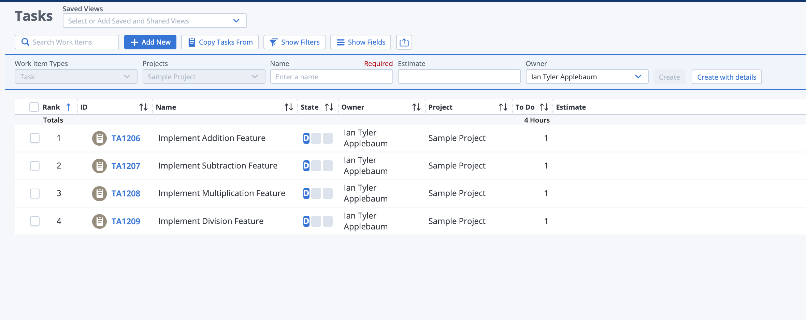
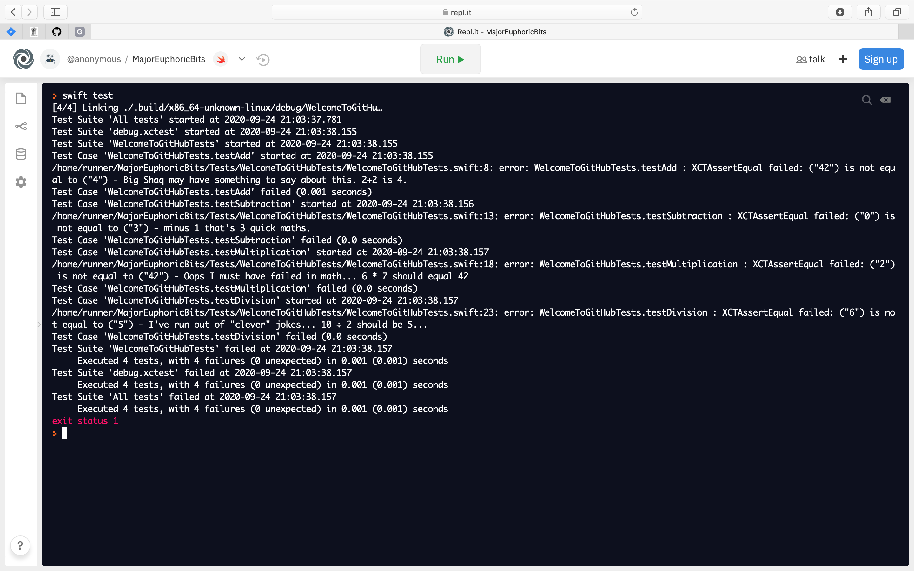

# Hello CIS Capstone!

Welcome to GitHub!

## Initial GitHub Repository Setup
I've given you Admin permission to this project. This means that you can setup protected branches. Let's make sure to setup main as a protected branch. I've provided a GitHub Action that will provide test results to each Pull Request. Make sure this is enabled. 

## The codes
There are 4 pieces of code broken in `Sources/WelcomeToGitHub/QuickMaths.swift` I promise it's obvious... Your task is to open a pull request fixing each feature!

For practice let's say in Rally we have a user Story "Math Feature" with the following tasks:

You are to hypothetically close these Rally tasks with Pull Requests upon completion. (1 pull request per task.)

Since not all of us have a Mac or the patience to set up the Swift compiler on Linux and Windows (yes as of Swift 5.3 Windows is supported) Let's use the online IDE Repl.it

Everything to start with in QuickMaths.swift is broken... There is no logic associated to the functions they just return a fixed number... Obviously your team has to change this. (Hint Swift's math operators are `+` `-` `*` and `/`)

This is what Repl.it will look like when you first click the `Run` button

Notice the `XCTAssertEqual failed: ("42") is not equal to ("4") - Big Shaq may have something to say about this. 2+2 is 4.`

When you correct this function it will say:
`Test Case 'WelcomeToGitHubTests.testAdd' passed (0.0 seconds)`
